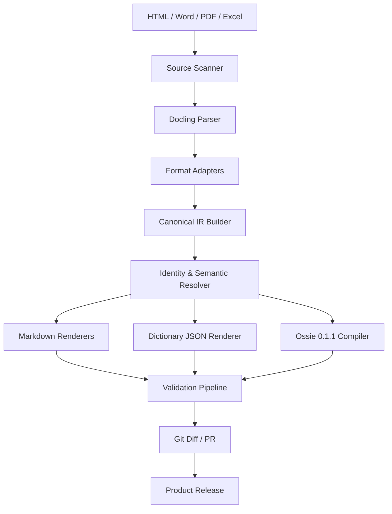

# AI Ready Data → Apache Ossie 변환 아키텍처 설계

- 작성일: 2026-08-08
- 상태: 설계 승인 완료
- 아키텍처 방식: Git 기반 모노레포 + Canonical IR 컴파일러
- 목표 Ossie 버전: 0.1.1

## 1. 요약

본 시스템은 복수의 AI Ready Data 프러덕트를 Git 모노레포에서 관리하고, 다음 세 종류의 원본 문서를 Docling 중심의 파이프라인으로 변환한다.

1. 데이터 프러덕트 정보 HTML
2. 데이터 시맨틱 Word/PDF
3. 데이터 딕셔너리 Excel

일차 산출물은 다음과 같다.

- `data-product.md`
- `data-semantic.md`
- `data-dictionary.json`

이 산출물과 동일한 Canonical IR을 이용해 Apache Ossie 0.1.1 형식의 `ossie-model.json`을 생성한다. 생성된 MD/JSON은 직접 수정하지 않으며 원본 문서, 설정 또는 ID Registry를 변경한 뒤 전체 파이프라인으로 재생성한다.

각 프러덕트는 불변 `product_id`와 `v1`부터 순차 증가하는 독립 숫자 버전을 가진다. 물리 테이블에도 불변 `table_id`와 독립 숫자 버전을 부여하며, 프러덕트와 테이블의 관계는 다대다로 관리한다. 같은 물리 테이블을 여러 프러덕트가 사용하면 동일한 `table_id`를 재사용한다.

LLM은 OpenAI-compatible API로 호출하며 특정 공급자나 모델에 종속되지 않는다. LLM은 비정형 문장에서 의미 후보를 추출하고 정규화하는 역할만 담당한다. 최종 IR과 Ossie 객체의 ID 매핑 및 출력은 결정적인 코드로 수행한다.

## 2. 목표와 제외 범위

### 2.1 목표

- 여러 데이터 프러덕트를 단일 저장소에서 일관되게 관리한다.
- HTML, Word, PDF, Excel의 구조와 출처를 보존한다.
- 문서에서 프러덕트 설명, 지표, 업무 규칙, 테이블, 컬럼, 키와 관계를 추출한다.
- 모든 중요 속성을 원본 파일의 위치까지 역추적한다.
- 프러덕트·테이블·컬럼·지표에 불변 ID를 부여한다.
- 프러덕트와 테이블의 다대다 관계를 탐색한다.
- Ossie 0.1.1 JSON을 결정적으로 생성하고 검증한다.
- 프러덕트별 버전, 변경 내역, 과거 산출물을 조회한다.
- 변경된 공통 테이블이 영향을 주는 모든 프러덕트를 탐지한다.
- OpenAI-compatible API endpoint와 모델을 설정으로 교체한다.
- 동일한 입력·도구·프롬프트·모델 결과에서 동일한 산출물을 재현한다.

### 2.2 제외 범위

- 생성된 MD/JSON을 사람이 직접 편집하는 기능
- 초기 버전의 웹 업로드 또는 검수 UI
- LLM이 자유 형식으로 최종 Ossie JSON을 작성하는 방식
- 모호한 테이블 이름 변경을 LLM이 자동 확정하는 기능
- Ossie 0.2 개발 스펙을 운영 릴리스에 사용하는 기능
- 데이터 행 샘플을 Git에 저장하는 기능

## 3. 확정된 설계 결정

| 항목 | 결정 |
|---|---|
| 실행 방식 | Git 기반 배치형 |
| 저장소 | 복수 프러덕트를 관리하는 단일 모노레포 |
| 변환 방식 | Canonical IR 컴파일러형 |
| 생성물 편집 | 완전 자동 생성, 직접 편집 금지 |
| 프러덕트·테이블 버전 | 각 객체별 `v1`~`v999` 단순 증가 버전 |
| 물리 스키마 | Excel에 DB/스키마/테이블/컬럼/타입/PK/FK 포함 |
| 프러덕트–테이블 관계 | 다대다 공동 사용 |
| LLM 연결 | OpenAI-compatible API Provider Adapter |
| 운영 Ossie | 0.1.1 JSON |

## 4. 전체 아키텍처



### 4.1 컴포넌트

| 컴포넌트 | 책임 | LLM 사용 |
|---|---|---|
| Source Scanner | 입력 역할, 경로, SHA-256, 변경 범위 식별 | 아니요 |
| Docling Parser | 문서 구조, 표, 문단, 레이아웃, OCR 추출 | Docling 내부 OCR만 선택 사용 |
| Format Adapters | Excel 셀·수식, PDF 좌표, HTML locator 보강 | 아니요 |
| IR Builder | 파싱 결과를 역할별 Canonical IR로 정규화 | 제한적으로 사용 |
| Identity Resolver | 이름을 불변 product/table/column ID로 연결 | 최종 결정에는 사용하지 않음 |
| Semantic Resolver | 지표, 동의어, 필터, grain, 규칙 정규화 | 예 |
| Renderers | IR에서 MD와 Dictionary JSON 생성 | 아니요 |
| Ossie Compiler | IR을 Ossie 0.1.1로 결정적 변환 | 아니요 |
| Validator | 스키마, 참조, SQL, 결정성, 품질검사 | 아니요 |
| Release Manager | 숫자 버전, changelog, tag, GitHub Release 관리 | 변경 설명에만 선택 사용 |

## 5. 저장소 구조

```text
ai-ready-data-registry/
├── README.md
├── pyproject.toml
├── uv.lock
├── .gitignore
├── .gitattributes
├── config/
│   ├── pipeline.yaml
│   ├── validation-rules.yaml
│   ├── llm-providers.yaml
│   ├── llm-providers.yaml.example
│   └── llm-lock.json
├── schemas/
│   ├── source-manifest.schema.json
│   ├── ir/
│   │   ├── data-product-ir.schema.json
│   │   ├── semantic-ir.schema.json
│   │   ├── data-dictionary-ir.schema.json
│   │   └── evidence-ir.schema.json
│   └── ossie/0.1.1/osi-schema.json
├── prompts/
│   ├── semantic-extraction/v1.0.0.yaml
│   ├── metric-extraction/v1.0.0.yaml
│   └── business-term-normalization/v1.0.0.yaml
├── templates/
│   ├── data-product.md.j2
│   ├── data-semantic.md.j2
│   └── changelog.md.j2
├── registry/
│   ├── products/<product-id>.json
│   ├── tables/<table-id>.json
│   ├── mappings/<product-id>.json
│   ├── aliases/
│   │   ├── products.json
│   │   └── tables.json
│   ├── indexes/
│   │   ├── product-keys.json
│   │   └── table-locators.json
│   ├── changesets/<changeset-id>.json
│   └── identity-events.jsonl
├── products/
│   └── <product-key>/
│       ├── product.yaml
│       ├── sources/
│       │   ├── product-info/*.html
│       │   ├── semantic/*.{docx,pdf}
│       │   └── dictionary/*.xlsx
│       ├── generated/
│       │   ├── manifest/source-manifest.json
│       │   ├── extraction-cache/<content-hash>.json
│       │   ├── ir/
│       │   │   ├── data-product.ir.json
│       │   │   ├── semantic.ir.json
│       │   │   ├── data-dictionary.ir.json
│       │   │   └── evidence.ir.json
│       │   ├── artifacts/
│       │   │   ├── data-product.md
│       │   │   ├── data-semantic.md
│       │   │   ├── data-dictionary.json
│       │   │   └── ossie-model.json
│       │   └── reports/
│       │       ├── validation-report.json
│       │       ├── lineage-report.json
│       │       └── change-report.json
│       ├── manifest.json
│       └── CHANGELOG.md
├── catalog/
│   ├── products.json
│   ├── tables.json
│   ├── product-table-links.json
│   ├── relationships.json
│   └── releases.json
├── src/ai_ready_compiler/
│   ├── cli/
│   ├── ingestion/
│   ├── parsers/
│   ├── adapters/
│   ├── ir/
│   ├── identity/
│   ├── semantic/
│   ├── renderers/
│   ├── ossie/
│   ├── llm/
│   ├── validation/
│   └── release/
├── tests/
│   ├── unit/
│   ├── integration/
│   ├── fixtures/
│   └── golden/
└── .github/
    ├── ISSUE_TEMPLATE/ard-content.yml
    └── workflows/
        ├── ard-issue-intake.yml
        ├── ard-direct-change.yml
        ├── ard-process.yml
        ├── ard-changeset.yml
        └── ard-release.yml
```

### 5.1 Git 추적 정책

- 추적: 최신 원본 문서, product 설정, Registry, 검증된 IR, 구조화 LLM 추출 cache, 최신 검증 산출물과 보고서
- 미추적: `.build/`, Docling 로컬 원시 cache, 로그, API 응답 envelope, 임시 OCR 이미지
- PDF, DOCX, XLSX는 Git LFS를 사용한다.
- 생성 파일명에는 실행시각, 랜덤 ID 또는 임시 경로를 넣지 않는다.
- 과거 버전은 제품·테이블 tag와 Git history로 조회하고 저장소 내부에 버전별 디렉터리를 복제하지 않는다.
- GitHub Release asset에는 해당 tag의 비공개 산출물, manifest와 검증 보고서를 묶어 게시한다. 별도의 승인된 export 절차 없이는 외부 공개하지 않는다.

## 6. ID 및 다대다 매핑

### 6.1 ID 형식

UUIDv7에 객체 접두사를 붙인다.

- 프러덕트: `prd_<uuidv7>`
- 테이블: `tbl_<uuidv7>`
- 컬럼: `col_<uuidv7>`
- 지표: `met_<uuidv7>`
- 관계: `rel_<uuidv7>`
- 연결: `lnk_<uuidv7>`

불변 ID와 사람이 읽는 key를 분리한다. key와 display name은 변경될 수 있지만 ID는 변경되지 않는다.

### 6.2 프러덕트

```yaml
product_id: prd_0198f6c2-8ac7-7f31-a48e-1c3d82e9a631
product_key: sales-order
display_name: Sales Order
aliases:
  - order-analytics
```

### 6.3 테이블 Registry

`registry/tables/<table-id>.json`은 table과 column의 불변 ID, 독립 숫자 버전, 현재 물리 locator, alias와 상태를 보관한다. 같은 정규화 locator가 여러 프러덕트에 등장하면 기존 `table_id`를 재사용한다. locator는 `source_system_id + catalog + schema + table_name`으로 계산하며 credential과 실제 endpoint는 포함하지 않는다.

이름 변경을 자동 확정할 수 없으면 `IDENTITY_CONFLICT`로 실패한다. 운영자가 `ard registry alias add`를 실행하면 CLI가 Registry와 `identity-events.jsonl`을 갱신한다. 사용자는 Registry 파일을 직접 편집하지 않는다.

### 6.4 프러덕트–테이블 링크

```json
{
  "link_id": "lnk_0198f6ce-c3d5-7fc8-9401-22fa7b330ec2",
  "product_id": "prd_0198f6c2-8ac7-7f31-a48e-1c3d82e9a631",
  "table_id": "tbl_0198f6ca-2a11-78d1-8672-67d49e69f14c",
  "usage": "REFERENCE",
  "required": true,
  "semantic_dataset": "customers"
}
```

`usage`는 `SOURCE`, `OUTPUT`, `REFERENCE`로 제한한다. 한 테이블은 여러 프러덕트와 연결될 수 있으며 소유 프러덕트를 강제하지 않는다.

### 6.5 중복 판정

신규 프러덕트는 명시된 `product_id`, 정규화 `product_key`, alias, canonical content hash 순서로 검사한다. 기존 ID와 key가 충돌하거나 ID 없이 기존 key를 신규 생성하려는 요청은 병합을 차단한다. canonical content hash가 기존 프러덕트와 같으면 새 버전을 만들지 않는 `NO_CHANGE`로 판정한다.

신규 테이블은 물리 locator를 우선 식별자로 사용한다. locator가 같으면 기존 `table_id`를 재사용하고 새 ID 발급을 차단한다. locator는 다르지만 schema hash가 같은 테이블은 자동 병합하지 않고 `POSSIBLE_CLONE`으로 보고한다. 이름 변경이나 물리 이동은 이전 locator와 운영자 결정을 명시한 identity event가 있을 때만 기존 ID를 유지한다.

LLM 또는 embedding 유사도는 `POSSIBLE_DUPLICATE` 후보를 만드는 데만 사용하며 ID 재사용, 병합 또는 이름 변경을 확정하지 않는다. 모든 중복 판정은 `duplicate-report.json`에 비교 대상 ID, 판정 단계, 근거 hash와 조치 방법을 기록한다.

### 6.6 폐기와 ID 재사용 금지

프러덕트와 테이블을 삭제하지 않고 `status: retired` tombstone으로 보존한다. 폐기는 현재 버전에서 1을 증가시킨 뒤 적용하며 `retired_at`과 선택적 `replaced_by`를 기록한다. 폐기된 ID는 어떤 신규 객체에도 재사용할 수 없다.

## 7. Canonical IR

IR은 `DataProductIR`, `SemanticIR`, `DataDictionaryIR`, `EvidenceIR`로 분리한다. 모든 IR은 다음 공통 정보를 가진다.

- IR schema version
- product ID
- source manifest hash
- pipeline, Docling, prompt, model version
- resolution status
- evidence references

참조 상태는 `RESOLVED`, `UNRESOLVED`, `AMBIGUOUS` 중 하나이다. 후자 두 상태가 존재하면 릴리스를 차단한다.

### 7.1 DataProductIR

HTML에서 다음을 추출한다.

- 프러덕트 이름, 설명, 목적, 도메인
- owner, contact, consumer
- 접근 방법과 보안 등급
- 갱신주기, freshness, SLA
- 사용 테이블 후보와 관련 링크

HTML의 테이블 이름은 DataDictionaryIR과 Registry를 확인한 뒤 `table_id`로 연결한다.

### 7.2 SemanticIR

Word/PDF에서 다음을 추출한다.

- 지표, 정의, 원본 계산식, 집계 방식
- 필터, 제외조건, grain, 시간 차원
- 업무 용어, 동의어, 예외, 사용 주의사항
- 관계 설명과 질문 예시

LLM은 의미 후보를 구조화하지만 ID를 직접 발급하거나 물리 매핑을 확정하지 않는다.

### 7.3 DataDictionaryIR

Excel에서 다음을 추출한다.

- platform, catalog/project, schema/dataset, table
- 컬럼명, 논리명, 타입, nullable, 설명
- PK, unique key, FK, 관계, cardinality
- sheet, row, cell range, formula, cached value, comment

Docling으로 표 구조를 읽고 openpyxl 기반 Adapter로 셀 주소, 수식, 병합 영역, 숨김 시트, 이름 정의 및 주석을 보강한다. 수식은 계산하지 않고 원본 수식과 저장된 계산값을 분리한다.

### 7.4 EvidenceIR

모든 지표, 관계, PK와 중요 설명은 최소 한 개의 Evidence를 가져야 한다.

- HTML: heading path, DOM locator, excerpt
- Word: heading path, paragraph/table index, Docling reference
- PDF: page, bounding box, Docling reference, excerpt
- Excel: workbook, sheet, range, formula

원문 전체를 Evidence에 복제하지 않고 필요한 짧은 excerpt와 위치만 저장한다.

### 7.5 문서 권위

| 정보 | 권위 문서 |
|---|---|
| 물리 테이블·컬럼·타입·PK/FK | Excel |
| 지표·계산식·필터·업무 규칙 | Word/PDF |
| 프러덕트 목적·owner·SLA·접근 | HTML |

권위 문서 간 충돌은 LLM이 해결하지 않고 `SOURCE_CONFLICT`로 실패한다.

## 8. Ossie 0.1.1 컴파일

운영 compiler는 vendored Ossie 0.1.1 JSON Schema와 그 SHA-256을 사용한다. upstream `main`의 0.2 개발 스키마로 자동 갱신하지 않는다.

### 8.1 매핑

| IR | Ossie 0.1.1 |
|---|---|
| product key/description | semantic model name/description |
| DataDictionaryIR table | dataset |
| physical FQN | dataset source |
| column | field |
| PK/unique key | primary_key/unique_keys |
| FK | relationship |
| SemanticIR metric | metric |
| synonyms/instructions/examples | ai_context |
| 내부 ID | custom_extensions |

Ossie 0.1.1에서 custom vendor 문자열은 제한되므로 `vendor_name: COMMON`을 사용하고 `data` 문자열 안에 `namespace: ai_ready_data`와 내부 ID를 넣는다.

### 8.2 BigQuery 식 처리

0.1.1에는 `BIGQUERY` dialect가 없으므로 다음 절차를 사용한다.

1. Canonical IR에 BigQuery 원본 식 보존
2. SQLGlot BigQuery parser로 AST 생성
3. ANSI SQL로 변환
4. 참조 컬럼, 함수, 집계 구조의 의미 동등성 검사
5. 손실이 없을 때만 `ANSI_SQL` expression 출력
6. 손실 가능성이 있으면 `OSSIE_DIALECT_LOSS`로 실패

Ossie 0.2가 정식 릴리스되면 별도 compiler profile을 추가한다. 운영 0.1.1 compiler의 출력을 암묵적으로 변경하지 않는다.

### 8.3 dbt 선택 프로파일

dbt Core 1.12+ 연동 시 다음 추가 조건을 적용한다.

- Ossie JSON을 dbt 프로젝트 `osi/` 또는 설정된 `osi-paths`에 배치
- dataset source가 해당 프로젝트의 dbt model FQN으로 해석되어야 함
- source, seed, snapshot, external table 참조 차단
- dbt 경고 `I078`을 오류로 승격
- `dbt compile`과 생성된 manifest/semantic manifest 검증

## 9. OpenAI-Compatible Provider

### 9.1 인터페이스

내부 코드는 `LLMProvider`의 `health_check`, `capabilities`, `generate_structured` 인터페이스에만 의존한다. `OpenAICompatibleProvider`가 `chat_completions` 또는 `responses` 요청으로 변환한다.

### 9.2 설정

```yaml
version: "1.0"
default_profile: primary
profiles:
  primary:
    provider: openai_compatible
    connection:
      base_url_env: ARD_LLM_BASE_URL
      api_key_env: ARD_LLM_API_KEY
      model_env: ARD_LLM_MODEL
      api_style: chat_completions
      timeout_seconds: 120
      verify_tls: true
    capabilities:
      structured_output: json_schema
      supports_seed: false
      supports_usage: true
    generation:
      sampling_parameters: omitted
      max_output_tokens: 8192
    retry:
      max_attempts: 3
```

API key는 환경변수 또는 CI secret으로만 주입한다. config, manifest, 로그, cache, Git에는 저장하지 않는다.

`temperature`, `top_p` 같은 sampling 파라미터는 기본 요청에서 생략한다. provider capability가
명시적으로 확인된 profile에서만 opt-in으로 사용한다.

### 9.3 구조화 출력

지원 순서는 JSON Schema, tool calling, JSON object이다. 그러나 실행 중 자동 fallback하지 않고 capability probe 후 profile에 방식을 고정한다. production profile에서 plain text JSON 추출은 허용하지 않는다.

API가 JSON Schema 준수를 주장하더라도 모든 응답을 Pydantic, JSON Schema 및 semantic rules로 다시 검증한다.

### 9.4 Provider lock과 cache

`llm-lock.json`에는 secret을 제외한 endpoint hash, API style, model, capability, generation parameter 및 SDK version을 기록한다. 릴리스 manifest에는 lock hash를 기록한다.

LLM cache key는 provider fingerprint, source chunk hash, prompt hash, output schema hash로 계산한다. 동일 key의 검증된 구조화 결과가 있으면 API를 다시 호출하지 않는다. 모델이나 provider가 바뀌면 새 cache key를 사용하고 semantic diff를 수행한다.

### 9.5 오류 처리

- timeout, 429, 5xx: 제한된 지수 backoff 재시도
- 401/403, 모델 없음: 즉시 실패
- JSON Schema 미준수: 동일 schema로 최대 한 번 재시도
- refusal, context 초과: 실패
- provider 또는 모델 자동 fallback: 금지

## 10. 검증 및 실패 처리

검증 순서는 다음과 같다.

1. 원본 파일과 역할 검증
2. Docling 파싱 품질
3. IR JSON Schema
4. ID·참조 무결성
5. 시맨틱 규칙
6. Ossie 0.1.1 JSON Schema 및 공식 validator
7. SQL 파싱·변환
8. 선택적 warehouse dry-run/dbt compile
9. 동일 입력 이중 빌드의 hash 결정성

기본 release gate는 error 0, unresolved 0, ambiguous 0, metric SQL validity 100%, Ossie compliance 100%, 중요 Evidence coverage 100%이다.

빌드는 `.build/<build-id>/candidate`에 작성한다. 모든 검증이 성공한 뒤에만 `generated/`로 atomic promote한다. 실패 시 마지막 정상 generated와 release는 유지하고 실패 보고서만 남긴다. 부분 산출물은 게시하지 않는다.

## 11. 버전과 릴리스

프러덕트와 테이블은 각각 독립적인 `1`~`999` 정수 버전을 사용하고 외부 표현은 `v<number>`로 통일한다. 신규 객체는 `v1`이며 변경된 객체는 현재 버전에서 정확히 1만 증가할 수 있다. 버전 건너뛰기, 역행, 변경 없는 증가와 변경 후 미증가는 모두 병합을 차단한다.

버전 비교용 canonical hash에서는 생성 시각, commit SHA, Actions run ID, LLM response ID, provenance 수집 시각, JSON key 순서와 Markdown 서식을 제외한다. 원본 파일이 달라도 canonical hash가 같으면 Git commit만 남기고 새 release를 생성하지 않는다. 파서, prompt 또는 provider 변경으로 canonical 의미가 달라지면 정상적인 객체 변경으로 처리한다.

### 11.1 증가 규칙

- 제품 설명, 업무 의미, 지표, 품질 규칙 또는 product-table mapping 변경: 해당 product `+1`
- 테이블 컬럼, 타입, nullability, key, 관계, 설명 또는 locator 변경: 해당 table `+1`
- 공용 테이블 변경: table `+1` 및 참조하는 모든 product `+1`
- mapping만 추가·삭제·역할 변경: product만 `+1`
- 제품 또는 테이블 폐기: 해당 객체 `+1` 후 `retired`
- canonical 변경 없음: 버전 유지 및 release 없음

제품 manifest는 참조하는 `table_id`와 `table_version`을 고정한다. 공용 테이블 변경은 `changeset_id`로 영향 제품별 PR을 연결하고 모든 PR이 승인·병합될 때까지 외부 연계를 보류한다.

각 PR은 `base_product_version`, `proposed_product_version`, `base_table_versions`를 기록한다. 동일 객체를 변경하는 다른 PR이 먼저 병합되면 `VERSION_STALE`로 차단하고 최신 `main` 기준으로 다시 계산한다. 주요 오류 코드는 `VERSION_GAP`, `VERSION_NO_CHANGE`, `VERSION_COLLISION`, `VERSION_LIMIT_REACHED`이다.

Git tag는 `product/<product-id>/v<number>`와 `table/<table-id>/v<number>` 형식을 사용한다. 제품 tag마다 GitHub Release를 만들고 table tag는 공용 테이블 변경의 불변 참조로 사용한다. release manifest에는 commit, tag, source hash, compiler/Docling/prompt/provider lock, target Ossie version, artifact hash, 이전 숫자 버전, validation 요약과 고정된 table ID/version을 기록한다.

과거 버전 조회는 다음 CLI로 제공한다.

```bash
ard history sales-order
ard show sales-order@12
ard diff sales-order@11..12
ard history sales-order --metric net_revenue
ard export sales-order@12 --format ossie
```

## 12. CLI와 CI/CD

주요 CLI는 다음과 같다.

```bash
ard product init <product-key>
ard build <product-key>
ard build --changed --base origin/main
ard registry sync <product-key>
ard registry conflicts
ard impact table <table-id>
ard validate <product-key>
ard release plan <product-key>
ard release create <product-key> --version auto
```

Git 작업 흐름은 Issue 또는 작업 브랜치 입력, Draft PR, `ard build`, 생성물 자동 commit, 품질·중복·버전 검증, review, merge, release 순서이다. 단일 orchestrator가 repository mutation에는 기본 `GITHUB_TOKEN`을 사용하고 private Issue 첨부 다운로드에는 격리된 `ARD_ATTACHMENT_TOKEN`만 사용해 승인된 Issue의 브랜치 생성부터 최종 commit status 등록까지 담당한다. 사람의 직접 변경은 작업 브랜치에만 허용하며 PR이 없으면 자동 생성한다.

private 저장소 Issue는 생성만으로 credential이나 LLM을 사용하지 않는다. write 이상의 권한을 가진 사용자가 저장소 반입 권한과 조직 정책을 검토하고 `ard:approved` label을 부여하며, workflow가 label actor 권한을 다시 확인한 뒤에만 `ard-private-intake`의 `ARD_ATTACHMENT_TOKEN`과 보호된 `ARD_LLM_API_KEY`를 각자의 trusted job에서 사용한다. 외부 fork PR, 승인 전 Issue와 `pull_request_target`에서 untrusted code를 checkout하는 실행에는 secret과 쓰기 권한을 제공하지 않는다.

`ard-issue-intake.yml`은 Issue Form과 첨부를 검증하고 `ard/issue-<number>-<product-key>` 브랜치와 Draft PR을 만든다. `ard-direct-change.yml`은 `products/*/sources/**` 변경을 감지해 제품 하나·버전 하나 규칙을 확인하고 PR을 생성 또는 갱신한다. 두 입력 경로는 `ard-process.yml`의 동일한 처리 계약을 사용한다.

PR pipeline은 Docling 파싱, OpenAI-compatible LLM 보조 추출, canonical IR/Ossie 생성, 중복·버전·completeness·provenance 검증을 수행하고 같은 PR 브랜치에 생성물을 commit한다. 필수 ID, 물리 구조, 참조 무결성, Ossie schema와 changeset 오류는 차단하고 설명·동의어·예시 누락은 경고와 completeness 점수로 보고한다. LLM은 시맨틱 후보만 `ai_suggested` provenance와 함께 보완하며 물리 구조나 ID를 추측하지 않는다.

`main` merge 후 `ard-release.yml`이 제품·테이블 tag와 제품 GitHub Release를 생성한다. 외부 catalog/API 연계는 보호된 GitHub Environment 승인을 받은 뒤 `workflow_call` 또는 `repository_dispatch` 확장점에서 실행한다.

GitHub Actions는 adapter일 뿐이며 실제 실행 계약은 containerized `ard` CLI이다. 동일 컨테이너를 GitLab CI, Jenkins 또는 Cloud Build에서도 실행할 수 있어야 한다.

## 13. 변경 영향 분석

영향 그래프의 주요 edge는 다음과 같다.

- source → product
- product ↔ product-table-link ↔ table
- table → column → metric
- table/column → relationship
- prompt/schema/compiler/template → 관련 산출물

Excel에서 공통 테이블이 변경되면 해당 table ID를 사용하는 모든 프러덕트를 재해석하고 Ossie와 validation을 재생성한다. 프롬프트, IR schema, Docling 또는 compiler가 바뀌면 구성 의존성에 따라 전체 또는 해당 문서 포맷 사용 프러덕트를 재생성한다.

## 14. 테스트 전략

- Unit: ID, locator, canonical hash, duplicate classification, link, numeric version, type mapping, expression
- Parser fixture: HTML, DOCX, digital/scanned PDF, XLSX merged header/composite key
- Golden: 고정 입력에 대한 MD/JSON/Ossie byte 비교
- Contract: IR schema, Ossie schema, CLI exit code, manifest schema
- Integration: 세 입력 형식에서 최종 릴리스까지
- Shared table: 동일 locator ID 재사용, rename 보존, 영향 탐지, 삭제 안전성
- Version: 신규 v1, 정확한 +1, no-change, stale base, gap, collision, v999 limit
- GitHub event: 승인 label 권한, 외부 fork secret 차단, 단일 제품 PR, generated write-back, protected release
- Failure: 손상 파일, schema 위반, 모호한 ID, SQL 손실, provider 장애

## 15. 보안과 운영

- Provider endpoint allowlist 및 redirect host 검증
- 외부 endpoint에는 HTTPS와 TLS 검증 강제
- localhost 또는 승인 내부 host에서만 HTTP 허용
- raw prompt/response 기본 로그 금지
- Authorization과 API key header redaction
- 원본과 구조화 cache에 동일한 보안 등급 적용
- 행 수준 샘플과 credentials를 Git 산출물에 포함하지 않음
- LLM endpoint에 보내는 chunk를 작업에 필요한 최소 범위로 제한
- build log에는 product/source/chunk ID와 hash만 기록

운영 지표는 parse coverage, physical resolution, Evidence coverage, SQL validity, Ossie compliance, determinism, shared impact coverage, cache hit rate, provider latency/error rate를 기록한다.

## 16. 수용 기준

1. 두 개 이상의 프러덕트가 독립 버전으로 빌드·릴리스된다.
2. HTML, Word/PDF, Excel에서 요구된 MD/JSON 네 종류가 생성된다.
3. 같은 물리 FQN은 모든 프러덕트에서 같은 table ID를 사용한다.
4. 한 테이블은 여러 프러덕트와 연결될 수 있다.
5. 공통 테이블 변경 시 모든 영향 프러덕트를 탐지한다.
6. 각 중요 객체를 원본 페이지·문단·셀까지 추적한다.
7. Ossie 0.1.1 JSON Schema와 공식 validator를 모두 통과한다.
8. BigQuery 전용 식의 ANSI 변환이 손실 가능하면 릴리스를 차단한다.
9. OpenAI-compatible endpoint, API style 및 모델을 config/env로 교체한다.
10. LLM 응답은 로컬 schema 검증 없이는 IR에 반영되지 않는다.
11. 동일 입력과 lock에서 생성물 hash가 일치한다.
12. 실패한 빌드는 마지막 정상 generated와 release를 덮어쓰지 않는다.
13. product/table/column/metric ID는 이름 변경 후에도 유지된다.
14. 과거 릴리스와 metric 변경 이력을 CLI로 조회한다.
15. Git과 manifest에 secret이나 원본 API 인증정보가 남지 않는다.
16. product와 table은 각각 독립적인 v1~v999 버전을 가지며 변경 시 정확히 1만 증가한다.
17. 동일 product key, table locator, canonical content가 중복 생성되지 않는다.
18. 공용 table 변경은 changeset으로 모든 영향 product의 버전 증가를 요구한다.
19. Issue는 `ard:approved` label과 승인자 권한 확인 전에는 LLM secret을 사용할 수 없다.
20. 저장소에는 최신 산출물만 유지하며 과거 버전은 Git tag, history와 GitHub Release로 재현한다.

## 17. 공식 참고자료

- Docling supported formats: https://docling-project.github.io/docling/usage/supported_formats/
- Apache Ossie repository: https://github.com/apache/ossie
- Ossie 0.1.1 schema: https://github.com/apache/ossie/blob/osi-0.1.1-rc1/core-spec/osi-schema.json
- Ossie development schema: https://github.com/apache/ossie/blob/main/core-spec/osi-schema.json
- dbt Ossie integration: https://docs.getdbt.com/docs/build/ossie-semantic-models
- OpenAI Structured Outputs: https://developers.openai.com/api/docs/guides/structured-outputs
- SQLGlot: https://github.com/tobymao/sqlglot
