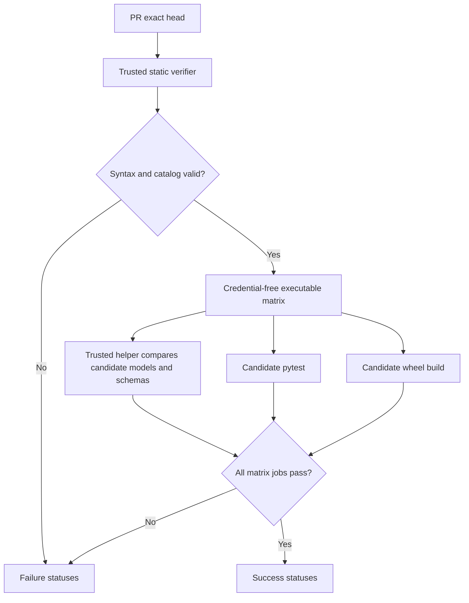

# Candidate Schema Verification Bootstrap Design

## Goal

Allow one pull request to change an existing Pydantic model and its checked-in JSON Schema while preserving the repository's trusted-code and credential-isolation boundaries.

The immediate acceptance target is PR #11. Its `ProductIR` model and `schemas/ir/product-ir.schema.json` are synchronized when evaluated from the candidate tree, but the current static gate compares the candidate schema with the older model imported from `main` and therefore always reports `SCHEMA_SYNCHRONIZATION_FAILED`.

## Confirmed root cause

The `pull_request_target` workflow deliberately runs `ard workflow repository-check` from the trusted default-branch checkout and points it at a separate candidate checkout. The static `schemas` verifier reads JSON Schema files from the candidate checkout but obtains `_MODEL_SCHEMAS` class objects from the trusted package. A valid model-and-schema change therefore compares two different revisions:

- model: trusted `main` revision;
- schema: pull-request candidate revision.

Run `31558093065` reproduced this exact boundary at PR #11 head `2e9b1d51541067a162111d0de56dfc258826f418`. The static step exited with `SCHEMA_SYNCHRONIZATION_FAILED`, so the credential-free executable jobs were skipped and both required repository statuses were published as failures.

## Security and correctness invariants

1. The static job must never execute candidate Python, build hooks, tests, actions, or shell scripts.
2. Any candidate execution must occur in a separate job with `contents: read`, no Environment, no write token, and no repository or provider secret.
3. The model-schema catalog remains owned by trusted `main`; a candidate cannot make validation pass by removing a model from its own tests or catalog.
4. Candidate model evaluation uses the exact pull-request head and is followed by the existing clean-tree and exact-head checks.
5. A malformed schema, missing catalog entry, unexpected non-Ossie schema, model import failure, or model-schema mismatch fails closed.
6. Required status names remain `ard/changeset` and `ard/quality-gate`; no branch-protection reconfiguration is required.
7. The bootstrap pull request changes no Pydantic model or checked-in model schema, allowing the current trusted verifier to validate and merge it safely.
8. The trusted parent fingerprints the helper before candidate execution and rejects any digest change afterward.
9. A zero child exit is insufficient: success requires a fresh nonce-bound receipt listing every trusted catalog path.

## Considered approaches

### 1. Split static and credential-free executable verification (recommended)

Keep schema parsing and catalog enforcement in the static group. Move only the comparison with `model_json_schema()` to a new credential-free executable group backed by a helper stored in trusted `main`.

This preserves the current trust boundary, supports model-and-schema changes to existing catalog entries in one pull request, and gives PR #11 a direct migration path. The trade-off is one additional executable matrix job.

### 2. Candidate-owned schema catalog

Store module and class references in a candidate-controlled manifest and let the trusted verifier consume it. This would allow adding a new schema kind in one pull request, but a candidate could also remove a protected entry and its schema together. Comparing against the base catalog could reduce the risk but would add migration rules and still weaken the simple trusted-catalog invariant.

This approach is rejected.

### 3. Manual two-phase model/schema migrations

Require every model change and schema change to land in separate pull requests or temporarily exempt one side of synchronization. This avoids candidate imports in the verifier but necessarily permits an intermediate inconsistent `main` revision or requires repeated special-case bootstrap workflows.

This approach is rejected. New catalog entries may still require a deliberate catalog bootstrap, but ordinary changes to existing models must remain atomic.

## Architecture

### Trusted model-schema catalog

Replace the current catalog of live class objects with immutable references owned by trusted code:

```text
(schema path, module name, class name)
```

The existing eight non-Ossie schema entries remain unchanged. Static verification derives the exact allowed schema path set from this trusted catalog. A pull request that adds or removes a schema path fails `SCHEMA_CATALOG_MISMATCH` until a separate trusted catalog change has merged.

The catalog is defined once in the trusted model-schema helper and imported by the repository verifier, preventing path lists from drifting between static and executable checks.

### Static schema verifier

The existing `schemas` verifier remains in the `static` group and continues to:

- discover every checked-in JSON Schema;
- parse it as JSON;
- validate it as Draft 2020-12;
- exclude the separately checksum-pinned Ossie subtree from the model catalog;
- require the remaining path set to equal the trusted catalog exactly.

It no longer imports or compares Pydantic classes. The static job therefore remains non-executable with respect to the candidate.

### Trusted executable model-schema helper

Add a small helper file to trusted code. It contains the trusted catalog and, when launched in the candidate project's isolated `uv` environment, performs the following operations:

1. resolve and validate the candidate repository root supplied by the trusted caller;
2. load each checked-in candidate schema from the trusted catalog path;
3. import the cataloged module and class from the installed candidate package;
4. require the resolved object to be a `StrictModel` subclass;
5. compare the parsed JSON value with `model_json_schema()` for exact equality;
6. suppress Python-level candidate stdout/stderr and map unexpected import or schema-generation termination to a stable error;
7. write a nonce-bound full-catalog completion receipt only after every comparison succeeds;
8. exit non-zero with a stable, non-secret-bearing error code on the first failure.

The repository verifier invokes the helper by absolute path from the trusted checkout. It does not use `python -m` or a helper path from the candidate tree. The command runs through `uv run --frozen` with the candidate repository as its project and working directory so imports resolve to the candidate package and lockfile. The trusted parent discards child failure evidence, verifies that the helper digest is unchanged, and accepts success only when the helper writes the exact nonce and all eight catalog paths to a fresh result location.

The helper is intentionally independent of candidate tests. Deleting or weakening candidate tests cannot remove this check. Candidate imports are still executable code, so they remain confined to the existing credential-free executable boundary; code review remains responsible for intentionally malicious runtime semantics, as it already is for the candidate `pytest` and `wheel` jobs. Automated verification additionally fails closed on accidental `SystemExit(0)`, unexpected import exceptions, missing or partial completion receipts, and helper-file mutation.

### Verification group and workflow

Add `model-schemas` as a fourth explicit `RepositoryCheckRequest.verification_group` and as a single-verifier group. The executable workflow matrix becomes:

```text
model-schemas, pytest, wheel
```

All three jobs retain:

- `contents: read` only;
- no `GH_TOKEN` environment variable;
- separate trusted and exact-head candidate checkouts;
- execution of only the trusted `ard workflow repository-check` lifecycle from the workflow shell step;
- the existing credential-free subprocess environment;
- exact-head and clean-tree validation before and after the verifier.

The finalizer remains unchanged and publishes success only when the static job and the complete executable matrix succeed.

## Data and control flow



## Error handling

- Invalid JSON or Draft 2020-12 schema: `SCHEMA_SYNCHRONIZATION_FAILED` in the static verifier.
- Missing or unexpected catalog path: `SCHEMA_CATALOG_MISMATCH` in the static verifier.
- Candidate dependency, import, startup, or timeout failure: the `model-schemas` executable verifier preserves trusted classification and retryability but emits only a stable parent failure message.
- Catalog object is absent or is not a `StrictModel` subclass: stable model-schema helper failure.
- Exact JSON mismatch: stable `SCHEMA_SYNCHRONIZATION_FAILED` helper failure identifying only the schema path.
- Candidate import prints or raises an unexpected exception: output is discarded and a stable helper failure is returned.
- Child exits zero without completing the full catalog: `REPOSITORY_MODEL_SCHEMAS_RECEIPT_INVALID`.
- Trusted helper changes during candidate execution: `TRUSTED_MODEL_SCHEMA_HELPER_CHANGED`.
- Candidate modifies its tracked tree during evaluation: existing `REPOSITORY_CHECK_TREE_CHANGED` failure.
- Any static or executable failure: the finalizer publishes failure for both required repository statuses.

## Testing strategy

Focused tests must be written and observed failing before implementation. They will prove:

1. static schema verification accepts a candidate schema synchronized with a newer candidate model even when trusted live classes differ, because static validation performs no model import;
2. static verification still rejects malformed schemas and catalog additions or removals;
3. the trusted helper rejects a valid but stale checked-in schema against the candidate model;
4. the trusted helper accepts the current candidate model schemas;
5. `model-schemas` is an explicit single-verifier group and receives the same credential-free environment as `pytest` and `wheel`;
6. the executable workflow matrix contains exactly `model-schemas`, `pytest`, and `wheel` and retains its read-only/no-token contracts;
7. the helper is invoked by an absolute trusted path rather than from the candidate checkout;
8. exact-head and clean-tree checks still bracket the executable verifier.
9. noisy runtime exceptions and `SystemExit(0)` cannot create a successful completion receipt;
10. a missing receipt or changed trusted helper fails closed in the parent verifier.

The complete repository gates remain pytest, Ruff, workflow YAML parsing, official actionlint through the repository static verifier, and sdist/wheel builds.

## Bootstrap and rollout

1. Implement only the verifier, trusted helper, workflow contract, tests, and documentation on a branch based on the latest `main`. Do not change any model or schema.
2. Open a separate bootstrap pull request. Its own CI can pass under the current verifier because the existing model schemas remain unchanged.
3. Review the bootstrap diff, require the current repository statuses to succeed, mark ready, and merge.
4. Update PR #11 onto the new `main` without dropping its reviewed changes.
5. Require a new PR #11 run from its exact updated head. The new static verifier checks syntax/catalog, and the new executable matrix checks candidate model-schema synchronization plus pytest and wheel.
6. Re-review the final PR #11 diff against the new base, mark ready, and merge only when both required statuses are successful for the live head.
7. Reprocess Issue #3 using the merged normalization contract and verify the regenerated `data-product.md` and `generated/ossie-model.json` in its data pull request.

## Non-goals

- Do not weaken or rename required statuses.
- Do not execute candidate code in the static job.
- Do not make the schema catalog candidate-controlled.
- Do not add secrets, write permissions, or protected Environments to executable verification.
- Do not modify PR #11's product-fact behavior in the bootstrap pull request.
- Do not permit an intentionally inconsistent model/schema revision on `main`.
